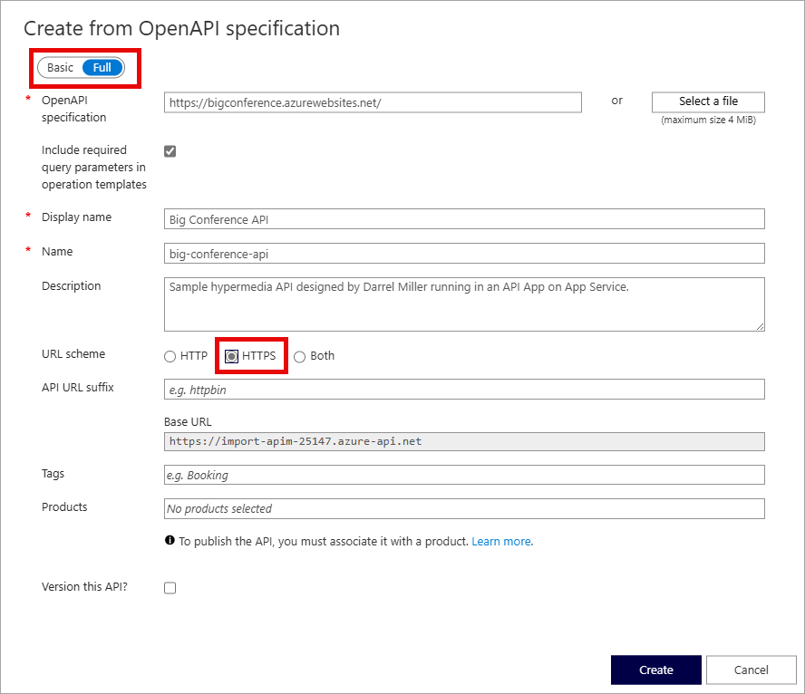

---
lab:
  topic: Azure API Management
  title: "Importación y configuración de una API con Azure\_API Management"
  description: 'Aprenda a importar, publicar y probar una API que se ajuste a la especificación OpenAPI.'
---

# Importación y configuración de una API con Azure API Management

En este ejercicio, creará una instancia de Azure API Management, importará una API de back-end de especificación OpenAPI, configurará los valores de la API, incluidos los requisitos de dirección URL del servicio web y de suscripción, y probará las operaciones de API para comprobar que funcionan correctamente.

Tareas realizadas en este ejercicio:

* Creación de una instancia de API Management (APIM) de Azure
* Importación de una API
* Configuración de los valores de back-end
* Prueba de la API

Este ejercicio se realiza en aproximadamente **20** minutos.

## Creación de una instancia de API Management

En esta sección de ejercicio, creará un grupo de recursos y una cuenta de Azure Storage. También registrarás el punto de conexión y la clave de acceso de la cuenta.

1. En el explorador, ve a Azure Portal [https://portal.azure.com](https://portal.azure.com) e inicia sesión con tus credenciales de Azure, si se te solicita.

1. Usa el botón **[\>_]** situado a la derecha de la barra de búsqueda en la parte superior de la página para crear una nueva instancia de Cloud Shell en Azure Portal, para lo que deberás seleccionar un entorno de ***Bash***. Cloud Shell proporciona una interfaz de la línea de comandos en un panel situado en la parte inferior de Azure Portal. Si se le pide que seleccione una cuenta de almacenamiento para conservar los archivos, seleccione **No se requiere ninguna cuenta de almacenamiento**, la suscripción y, después, seleccione **Aplicar**.

    > **Nota**: si has creado anteriormente una instancia de Cloud Shell que usa un entorno de *PowerShell*, cámbiala a ***Bash***.

1. Cree un grupo de recursos para los recursos necesarios para este ejercicio. Sustituya **myResourceGroup** por un nombre que quiera usar para el grupo de recursos. Puede reemplazar **eastus2** por una región cercana si es necesario. Si ya tiene un grupo de recursos que quiere usar. continúe al paso siguiente.

    ```azurecli
    az group create --location eastus2 --name myResourceGroup
    ```

1. Cree algunas variables para que usen los comandos de la CLI, lo que reduce la cantidad de escritura. Reemplace **myLocation** por el valor que ha elegido antes. El nombre de APIM debe ser único a nivel mundial; el siguiente script genera una cadena aleatoria. Reemplace **myEmail** por una dirección de correo electrónico a la que pueda acceder.

    ```bash
    myApiName=import-apim-$RANDOM
    myLocation=myLocation
    myEmail=myEmail
    ```

1. Cree una instancia de APIM. El comando **az apim create** para crear la instancia. Reemplace **myResourceGroup** por el valor que ha elegido antes.

    ```bash
    az apim create -n $myApiName \
        --location $myLocation \
        --publisher-email $myEmail  \
        --resource-group myResourceGroup \
        --publisher-name Import-API-Exercise \
        --sku-name Consumption 
    ```
    > **Nota:** La operación debe completarse en unos cinco minutos. 

## Importación de una API de back-end

Esta sección explica cómo importar y publicar una API de back-end de Especificación OpenAPI.

1. En Azure Portal, busque y seleccione **Servicios de API Management**.

1. En la pantalla **Servicios de API Management**, seleccione la instancia de API Management que ha creado.

1. En el panel de navegación **Servicio API Management**, seleccione **> APIs** y después **APIs**.

    


1. Seleccione **OpenAPI** en la sección **Crear a partir de la definición** y establezca el botón de alternancia **Básico o Completo** en **Completo** en el elemento emergente que aparece.

    

    Use los valores de la tabla siguiente para rellenar el formulario. Puede dejar los campos que no se mencionan con su valor predeterminado.

    | Configuración | Valor | Descripción |
    |--|--|--|
    | **Especificación de OpenAPI** | `https://bigconference.azurewebsites.net/` | Hace referencia al servicio que implementa la API, las solicitudes se reenvían a esta dirección. La mayor parte de la información necesaria en el formulario se rellena automáticamente después de escribir este valor. |
    | **Esquema URL** | seleccione **HTTPS**. | Define el nivel de seguridad del protocolo HTTP aceptado por la API. |

1. Seleccione **Crear**.

## Configuración de las opciones de API

Se crea *Big Conference API*. Es el momento de configurar los valores de la API. 

1. Seleccione **Configuración** en el menú.

1. Escriba `https://bigconference.azurewebsites.net/` en el campo **URL del servicio web**.

1. Anule la selección de la casilla **Es necesaria una suscripción**.

1. Seleccione **Guardar**.

## Prueba de la API

Ahora que la API se ha importado y configurado, es el momento de probarla.

1. Seleccione **Probar** en la barra de menús. Esto mostrará todas las operaciones disponibles en la API.

1. Busque y seleccione la operación **Speakers_Get**. 

1. Selecciona **Enviar**. Es posible que tenga que desplazarse hacia abajo en la página para ver la respuesta HTTP.

    Back-end responde con **200 Aceptar** y algunos datos.

## Limpieza de recursos

Ahora que has terminado el ejercicio, debes eliminar los recursos en la nube que has creado para evitar el uso innecesario de recursos.

1. Ve al grupo de recursos que creaste y visualiza el contenido de los recursos usados en este ejercicio.
1. Selecciona **Eliminar grupo de recursos** en la barra de herramientas.
1. Escribe el nombre del grupo de recursos y confirma que deseas eliminarlo.

> **PRECAUCIÓN:** Al eliminar un grupo de recursos se eliminan todos los recursos que contiene. Si ha elegido otro grupo de recursos para este ejercicio, también se eliminarán los recursos existentes fuera del ámbito de este ejercicio.
